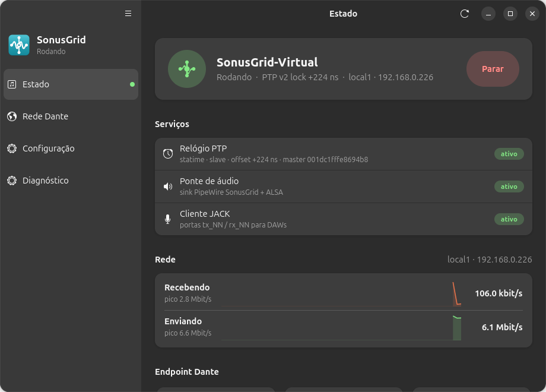
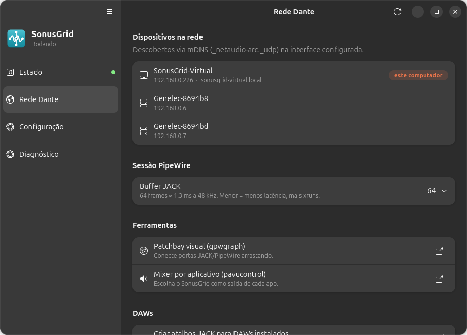
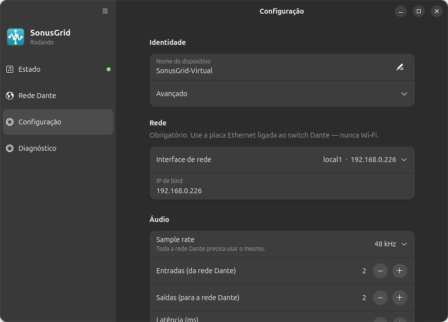

<p align="center">
  
</p>

<h1 align="center">SonusGrid</h1>

<p align="center">
  <b>[PT]</b> Transforme um PC Linux em um dispositivo de áudio compatível com redes Dante.<br>
  <b>[EN]</b> Turn a Linux box into an audio endpoint that interoperates with Dante audio networks.
</p>

<p align="center">
  <a href="#instalação">Instalação</a> ·
  <a href="#uso-rápido">Uso rápido</a> ·
  <a href="docs/USER_GUIDE.md">Guia do usuário</a> ·
  <a href="docs/DAW.md">DAW / JACK</a> ·
  <a href="docs/TROUBLESHOOTING.md">Troubleshooting</a> ·
  <a href="#english">English</a>
</p>

---

> **Compatible with Dante audio networks; not affiliated with Audinate Pty Ltd.**
> "Dante" é marca registrada da Audinate. O nome aparece aqui apenas para descrever interoperabilidade.

## O que é

O SonusGrid faz o seu Linux aparecer no **Dante Controller** como um dispositivo com N canais de
entrada e N de saída (16 × 16 por padrão, até 256). Qualquer app do sistema — Spotify, Firefox,
OBS, Audacity — pode tocar e gravar da rede Dante; DAWs (Reaper, Ardour, Bitwig) enxergam um
cliente JACK multicanal de baixa latência.

Ele reúne, num único pacote:

| Componente | Função |
|---|---|
| **Statime** (Rust) | daemon PTP v1/v2 — sincroniza o relógio de mídia com a rede Dante |
| **SonusGrid Engine** (Rust, fork do [Inferno](https://github.com/teodly/inferno)) | plug-in ALSA que fala o protocolo Dante (ARC/CMC/DBC, RTP, mDNS) |
| **sonusgrid-bridge** (Rust) | ponte full-duplex PipeWire ↔ JACK ↔ ALSA em um só processo |
| **sonusgrid** (Rust) | CLI: `start`, `stop`, `status`, `doctor`, `logs`, `config` |
| **GUI** (GTK4 / libadwaita) | status, roteamento, configuração, ferramentas |

<!-- SCREENSHOT: tela principal (Status) da GUI -->
<p align="center">
  
</p>

## Requisitos

- **Linux x86-64 ou ARM64** com **PipeWire ≥ 0.3.65** (Ubuntu 22.04+, Debian 12+, Mint 21+, Fedora 36+, Arch).
- **Placa de rede Ethernet dedicada** ligada ao switch dos equipamentos Dante.
  **Wi-Fi não funciona** — Dante exige jitter < 1 ms.
- Um PC Windows/macOS com **Dante Controller** na mesma rede para rotear canais
  (a Audinate não distribui o Controller para Linux).
- Kernel low-latency é recomendado, não obrigatório (`sudo apt install linux-lowlatency`).

## Instalação

### Ubuntu / Debian / Mint (pacote `.deb`)

```bash
git clone https://github.com/chrisvalezi/sonusgrid.git
cd sonusgrid
./install.sh
```

O `install.sh` instala as dependências, usa o `.deb` pronto em `dist/` (ou compila um se não
houver), instala com `apt`, adiciona você ao grupo `audio` e roda o `sonusgrid doctor`.
Já tem um `.deb` baixado da página de *Releases*? Então basta:

```bash
sudo apt install ./sonusgrid_0.2.1-1_amd64.deb
```

### Fedora / Arch / openSUSE (a partir do fonte)

```bash
./install.sh            # detecta a distro, instala deps, compila e instala em /usr
```

### Desinstalar

```bash
./uninstall.sh          # mantém ~/.config/sonusgrid
./uninstall.sh --purge  # remove tudo
```

Detalhes (dependências, build manual, cross-compile ARM64, AppImage): [docs/INSTALL.md](docs/INSTALL.md).

## Uso rápido

1. **Escolha a interface de rede** ligada ao switch Dante.
   GUI: menu → **SonusGrid** → aba *Configuração* → *Interface de rede* → **Aplicar**.
   Terminal: `sonusgrid config edit` e preencha `[network] interface = "enp3s0"`.

2. **Inicie**:
   ```bash
   sonusgrid start
   ```
   ou clique em **Iniciar** na GUI. Em ~5–10 s o status fica verde
   (o serviço espera o relógio PTP travar antes de abrir o áudio).

3. **Roteie** no Dante Controller: o dispositivo `SonusGrid-Virtual` aparece na matriz com
   16 TX × 16 RX.

4. **Mande áudio**: em qualquer app escolha a saída **SonusGrid (Dante-compatible)**
   (`sonusgrid route` abre o pavucontrol já na aba certa). Para gravar da rede, a fonte
   **SonusGrid_RX** aparece como um microfone.

<!-- SCREENSHOT: aba Roteamento -->
<p align="center">
  
</p>

### Comandos do CLI

| Comando | O que faz |
|---|---|
| `sonusgrid start` / `stop` / `restart` | liga/desliga os dois serviços (relógio PTP + ponte de áudio) |
| `sonusgrid status [--json]` | estado dos serviços, sink PipeWire e cliente JACK |
| `sonusgrid doctor` | diagnóstico completo, bilíngue — **rode isto antes de pedir ajuda** |
| `sonusgrid logs [clock\|audio] [-f]` | journal dos serviços |
| `sonusgrid config init\|show\|edit\|check` | gerencia `~/.config/sonusgrid/config.toml` |
| `sonusgrid devices` | dispositivos Dante visíveis via mDNS |
| `sonusgrid route` | abre o pavucontrol focado no SonusGrid |

Os serviços são **units de usuário do systemd** (`sonusgrid-clock.service`,
`sonusgrid-audio.service`) e são habilitados no primeiro `start` — depois disso sobem sozinhos
no login.

<!-- SCREENSHOT: aba Configuração -->
<p align="center">
  
</p>

## Como funciona

```
 apps Pulse (Spotify, Firefox)        DAW via JACK (Reaper, Ardour)
        │  sink "SonusGrid"                 │  SonusGrid:tx_01..tx_16
        ▼                                   ▼
 ┌───────────────────── sonusgrid-bridge ─────────────────────┐
 │  mistura por canal  →  plug:sonusgrid (ALSA, full-duplex)  │
 │  captura            ←  canais 1+2 → fonte "SonusGrid_RX"   │
 │                        todos os canais → SonusGrid:rx_NN   │
 └────────────────────────────┬───────────────────────────────┘
                              │ plug-in ALSA "SonusGrid Engine"
                              │ RTP + mDNS + ARC/CMC     ◄── relógio via Statime (PTP)
                              ▼
                    switch + equipamentos Dante
```

Arquitetura interna, decisões e limites em [docs/ARCHITECTURE.md](docs/ARCHITECTURE.md).

## Problemas?

```bash
sonusgrid doctor        # diz exatamente o que está errado e como corrigir
sonusgrid logs -f       # log ao vivo dos dois serviços
```

Cada mensagem do `doctor` tem uma seção em [docs/TROUBLESHOOTING.md](docs/TROUBLESHOOTING.md).
Ao abrir uma *issue*, cole a saída do `doctor`, `sonusgrid version` e `lsb_release -a`.

## Estrutura do repositório

```
crates/sonus-cli/         CLI `sonusgrid` (Rust)
crates/sonusgrid-bridge/  ponte PipeWire/JACK ↔ ALSA (Rust)
crates/sonusgrid-engine/  engine Dante — fork do Inferno (plug-in ALSA, mDNS, usrvclock)
crates/inferno-c/         binding C do engine (usado pelo plug-in HAL do macOS)
vendor/statime/           daemon PTP (fork do Statime com exportação de relógio virtual)
gui/sonus-gtk/            GUI GTK4/libadwaita (Python)
systemd/                  units de usuário + drop-in do PipeWire
packaging/                debian/, udev, AppImage
macos/                    porte macOS (HAL plug-in + launchd) — experimental
docs/                     documentação PT-BR (+ docs/en/)
install.sh / uninstall.sh instalador de um comando
Makefile                  build, deb, appimage, install
```

## Desenvolvimento

```bash
make build      # statime + engine + cli + bridge + gui   (~5 min na primeira vez)
make test       # testes unitários + smoke test do CLI
make deb        # gera dist/sonusgrid_<versão>_amd64.deb
make install    # instala em /usr (PREFIX=... para mudar)
```

Precisa de: Rust ≥ 1.75, `pkg-config`, `libasound2-dev`, `libpulse-dev`, `libjack-jackd2-dev`,
`devscripts debhelper` (para o `.deb`). O `install.sh --build` instala tudo isso.

## Licença

**GPL-3.0-or-later** (herdada do Inferno). Veja [COPYING](COPYING) e
[COPYING.thirdparty](COPYING.thirdparty) para Statime (Apache-2.0/MIT) e demais dependências.

---

## English

**SonusGrid** turns a Linux machine into a Dante-compatible audio device: a PTP clock daemon
(Statime), an ALSA plug-in speaking the Dante protocol (SonusGrid Engine, a fork of Inferno),
a native PipeWire ↔ JACK ↔ ALSA bridge and a GTK4 GUI. Any Linux app can play to / record
from the Dante network; DAWs get a 16×16 (up to 256×256) JACK client.

```bash
git clone https://github.com/chrisvalezi/sonusgrid.git && cd sonusgrid
./install.sh                       # Debian/Ubuntu: .deb; others: build from source
sonusgrid config edit              # set [network].interface to the NIC on the Dante switch
sonusgrid start                    # or use the GUI
sonusgrid doctor                   # bilingual diagnostics
```

English docs: [Install](docs/en/INSTALL.md) · [User guide](docs/en/USER_GUIDE.md) ·
[Troubleshooting](docs/en/TROUBLESHOOTING.md) · [FAQ](docs/en/FAQ.md) ·
[Architecture](docs/ARCHITECTURE.md).

*Compatible with Dante audio networks; not affiliated with Audinate Pty Ltd.*
